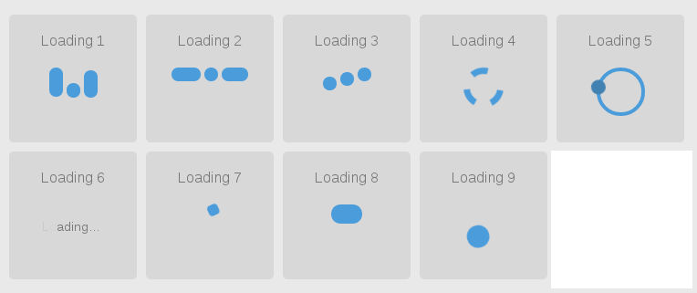

# HTML 页面 Loading (加载) 效果 #

> 本文主要介绍一款基于 CSS3 的 Loading 组件 Yloading
> 

## 使用  ##
> Yloading 参数如下:
> - status: 状态, 类型 string, 当 status == 'show' 时，显示加载图标， 其他则隐藏loading效果， 默认隐藏
> - type: 选择 loading 效果， 类型 number 上图从左到右， 从上到下 依次为 编号 1 - 9, 默认 1
> - color: 颜色, 类型 string(有效的颜色值), 默认 '#4b9cdb'

> 在页面引入： 
> 首先在页面中 引入 Yloading 脚本， 例如：
```html
<script src="/static/common/loading/loadingh5-1.5.js"></script>
```

> 在需要显示 loading 图标的地方，调用 Yloading 
```javascript
(function() {
    //...
    Loading('show', 3, 'yellow')
    //...
}())
```
> 关闭 loading 调用 Yloading 
```javascript
(function() {
    //...
    Loading('hide')
    //...
}())
```
