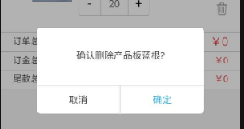

# H5 Confirm 组件 #

> 本文主要介绍一个款适用于 h5 页面的 confirm 组建
> 

## 使用 Yh5confirm ##
> 1、引入Yh5confirm 
```html  
<script src="/static/common/yh5confirm.js"></script> <!--引入 confirm-->
```

> 2、调用Yh5confirm
```javascrip
Yh5Confirm({
    confirmText: 'confirm to delete ?',
    confirmTextColor: '#323232',
    confirmTextSize: '12px',
    }, (choose) => {  //choose == true or false
       if(choose) {
        console.log('click right button')
       } else {
        console.log('click left button')
       }
    }
})
```

> 3、参数说明
>> confirmText: 确认提示内容， string, default: 确定此操作？  
>> confirmTextColor: 提示内容字体颜色， string, default: #323232  
>> confirmTextSize: 提示内容字体大小， string('XXpx'), default: 14px  
>> leftButtonText: 左侧按钮内容， string, default: 取消  
>> leftButtonTextColor： 左侧按钮字体颜色, string, default: '#323232'   
>> leftButtonTextSize: 左侧按钮字体大小， string('XXpx'), default: 14px
>> rightButtonText: 右侧按钮内容， string, default: 确定  
>> rightButtonTextColor： 右侧按钮字体颜色, string, default: '#30b2fb'   
>> rightButtonTextSize: 右侧按钮字体大小， string('XXpx'), default: 14px 
