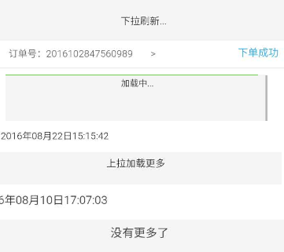

# H5 分页组件 #
> 本文主要介绍一下在 h5 端如何实现列表的分页加载， 更简单的说就是实现，页面顶部下拉: 刷新当前列表; 页面底部上拉: 加载更多。  
> 外部依赖： http请求使用的是api [reqwest](https://github.com/ded/reqwest),
> 

## Yscroll 使用 ##
> 1、在使用页面先引入 reqwest, 然后引入 yscroll.js   
> 2、配置参数
>> - target: 列表元素的父元素 **id**, 类型string, 必填
>> - refresh: 是否允许刷新功能： true 可以刷新， false 禁止刷新。 类型 boolean, 选填， default: true
>> - url: 请求列表的地址。 选填  
>> - headers: http请求头部的字段   
>> - param： 请求参数， 选填， 类型 对象
>> - height: 整个列表可视区域的高度(单位px)。类型 number， default： 屏幕高度，即 window.screen.height
>> - loadImmedate: 是否在初始化的时候就请求数据， 如果为false则在上拉后请求数据。类型 boolean, 选填， default： true。
>> - preload: 是否使能预加载，即浏览器拉到底部一定位置时自动请求下一页。类型 boolean, 选填， default： true   
>> - cb: 回调函数, 选填， 类型 function

> 3、reset 方法
>> - url: 请求地址， 选填
>> - param: 请求参数， 选填， 类型 对象
>> - cb: 回调函数， 选填， 类型 function

> **缺点：** 加载提示图标未作优化
>
> 3、初始化：  
```
  var options = {}  //配置参数, 所有参数组成一个对象
  options.target = 'list-wrap'
  options.url = '/api/list/'
  var yscroll = new Yscroll(options, function(err, resp){  //回调函数
     if(err) {  //报错
         console.log('err', err)
         return
     }
     if(resp == 'refresh') {   
        //code clear list
        list = []
     } else {  //根据结果渲染列表
        // render list
        //...
     }   
 })
```

> 4、Yscroll 的 reset 方法， 主要用于 url 或 请求参数改变的场景    
```    
//首先new 一个 Yscroll 对象 如上例
    yscroll.reset(
      '/api/list',
      {keywords: key},  //请求参数， 无参数传空对象
      function(err, resp) {
          if(err) { //报错
              console.log('err', err)
              return
          }
         if(resp == 'refresh') {   
            //code clear list
            list = []
         } else {  //根据结果渲染列表
            // render list
            ...
         }    
      }
    )
```