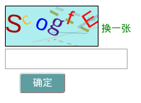

# html 验证码组件 #

> 关键字： 验证码， js, javascript, 校验, code, 

> 本文将介绍一种基于js实现的一款验证码生成校验组件，    
> 验证码输入忽略大小写  
>   
> **注意**： 如果对安全性要求高的应用不建议采用此组件， 无法抵御脚本攻击  


## Yverifycode 使用 ##

### html 标签元素 ###  
> 使用Yverifycode 时需要绑定三个 html 元素的 id 属性
> - 容纳验证码图片的容器， 例如：下面例子中的 #code-win, 容器的容器的尺寸决定了验证码图片的尺寸, 该元素是必须的   
> - 更换验证码的按钮， 例如： 下面例子中的“换一张”, 此按钮是用于更换验证码图片的， 该元素不是必须的，也可以调用 Yverifycode.reset 方法实现  
> - 验证码输入框, 例如： 下面例子中的 #code-input, 用于输入验证码， 该元素是必须的   

```html
<div id="for-code" class="for-code">
    <div id="code-win" class="code-win"></div>
    <input type="button" id="code-reset" value="换一张"> 
    <br> 
    <input type="text" id="code-input"> <br>
    <input type="button" id="code-verify" value="确定">
</div>
```

### 组件调用 ###
> **1、引入Yverifycode** 在 html 文件或以模块化方式在 js 文件中引入  

> **2、初始化** Yverifycode 初始化参数以对象的形式传入，参数如下：  
> - **input**: 对应验证码输入框的 id 属性值， 必填， 类型 string  
> - **container**: 验证码图片对应容器(元素) id 属性值, 必填， 类型 string  
> - **reset**: 更新验证码元素 id 属性值， 非必填， 类型 string  
> - **length**: 验证码位数， 非必填， 类型 number, 默认值 4   
> - **width**: 验证码初始化显示宽度， 非必填， 类型 number, 默认 100(px)
> - **bgColor**: 验证码图片背景颜色， 非必填， 类型 16色值(例如：#ff0000), 默认白色  
> - **bgImg**: 验证码图片背景图片： 非必填， 类型 图片地址(sting), 使用优先级高于背景颜色， 即同时设置 bgColor 和 bgImg: 只有 bgImg 生效  

> **3、获取验证结果** 调用 Yverifycode 的 verify 方法获取校验结果，如果返回结果为 true, 表示校验通过， 为 false 校验失败  

> 例： 
```javascript
//配置初始化参数
let verOpt = {
    input: 'code-input',
    container: 'code-win',
    reset: 'code-reset',
    length: 6,
    bgColor: '#AEEEEE',
    bgImg: '/static/images/default.jpg'
}
//实例化 Yverifycode
let yVerifycode = new Yverifycode(verOpt)
//调用 reset 方法 重置验证码
// $('#code-reset').click(() => {
//     yVerifycode.reset()
// })
//调用 verify 方法 获取校验结果 
$('#code-verify').click(() => {
    let state = yVerifycode.verify()
    if(state) {
        alert('Pass')
    } else {
        alert('Failed')
    }
})
```